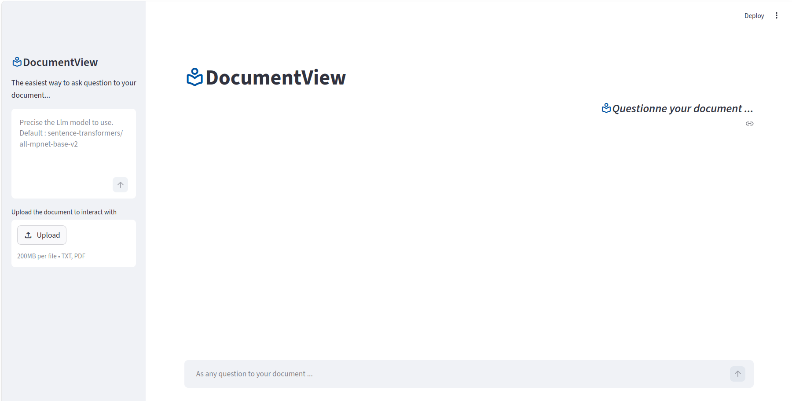
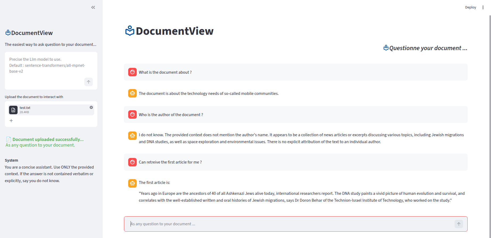

# documentView
The documentView API enables semantic search and question answering over documents using a Retrieval-Augmented Generation (RAG) pipeline. 
The purpose of RAG is to specialize an Large Language Model on a particular dataset corpus without complex retraining effort.

To summarized, a RAG process consistes of five steps :
- Load the document a extract the corpus
The first step consistes of extracting the textual content of the doccument from it original medium (either Pdf, web page, or .txt doc). 

- Chunked the document into a serie of overlaping shorter portion
This step consistes of dividing the entire document into a number of smaller chunks

- Vector base :Embeddings and indexing
This step consiste of converting each document chunk into a vector (embedings) using a LLM. Then indexing the embeddings to associated each with appropriate index which enables also to uniquely identify the corresponding chunk. Then ensemble of chunked document, embeddings and indexes correspond to the vector database of the corpus text.

- Retrial and chat (user question) processing
The last step consiste of retreiving information from the document through retreival and generation process. This means, when a user as question, the question is converted to a vector using the same LLM that was used to generate embeddings of the corpus text. The question's embadding is then use to conduct similarity search to vector database, the top k most similar chunk are the retreived.

- Prompt engineering and generation 
 Finaly both the question and the top k chunked are used to build the prompt to send to the LLM to generate the final answer that is send back to the user.

In section, I provide details of technical and scientific implementation of documentview.

# 1. Quit start

Working with DocumentView is very simple. After installation, one simply upload a document and start questionning it. for the moment both `Pdf` and `txt` are supported.

The installation procedure of `DocumentView` is the following:
- clone the repository 
```
  git clone https://github.com/DonaldMOUAFO/documentView.git
```
- Navigate to the documentView/
```
  cd documentView/
```
- Create a virtual environement 
```
  conda create -m my/env/name
```
- Install requirements.txt
```
  pip install -r requirement.txt
```
- Install documentView
```
  pip install .
```
If you want to edit the code, do not hesitate to install the package in editable mode `pip install -e .`
After installation, the app can be run as follow.
```
  streamlit run src/application/app.py 
```
#### Work with `documentview`
After running the previous code, the UI interface can be access at the address [http://localhost:8501]. 
The UI of documentview looks as follows.
<p align="center"> 
  
  <p style="font-size: 18px; color: gray; text-align: center">
    Documentview user interface.
  </p> 
</p>
The user can upload a document to start interacting with.The actual document handel are `Pdf` and `txt`.

### Typical UI for DocumentView and example discussion
The following image is an illustration of the User Interface of DocumentView.
<p align="center"> 
  
  <p style="font-size: 18px; color: gray; text-align: center">
    One can see typical discussion with the uploaded document.
  </p> 
  <!---<li style="color:red"; "text-align: center" ><b>One can see typical discussion with the uploaded document. </li> --->
</p>

# 2. Deploiement from docker container
To run documentview in a server, docker deployement is recommanded.

## 2.1 Docker image and container registery

After pulling the repository from the server or what ever computer.
```
  docker compose down
  docker compose up -d
  docker exec -it ollama-server ollama pull llama3
```
Documentview is accessible at [http://localhost:8501].

## 2.2 Docker deploiement from setup.sh
On simple way is to download `setup.sh` on your local computer and excute it as follow.
``` 
  ./setup.sh
```
You can also override the model at runtime without editing the script:
```
  OLLAMA_MODEL=mistral ./setup.sh
```
## 2.3 On windows deskpot or server

  ### 2.3.1 Installation with setup.ps1
    Windows requires a different approach since it doesn't have bash natively. The equivalent is a PowerShell. The corresponding script is `setup.ps1`.
    To run it, first open PowerShell as Administrator and execute the following code.
    ```
      Set-ExecutionPolicy -ExecutionPolicy RemoteSigned -Scope CurrentUser
      .\setup.ps1
    ```
    Similarly, to use a different model :
    ```
      $env:OLLAMA_MODEL="mistral"; .\setup.ps1
    ```
  ### 2.3.1 Installation with setup.bat
    More simply, download `setup.bat` file and place it anywhere on the Windows machine and **double-click** on it. 
    Here's what the user's experience looks like:
    ```
      ****************************************************
      *                                                  *
      *        DocumentView  --  Installer               *
      *                                                  *
      ****************************************************

      [INFO]   Checking required tools...
      [OK]     All tools are available.
      [INFO]   Cloning repository...
      [OK]     Repository ready.
      [INFO]   Building Docker images (this may take a few minutes)...
      [OK]     Containers are running.
      [INFO]   Waiting for Ollama to be ready...
      [OK]     Ollama is ready.
      [INFO]   Pulling model 'llama3'...
      [OK]     Model 'llama3' ready.
      [INFO]   Opening the app in your browser...

        Streamlit app  >  http://localhost:8501
        ...

      Press any key to continue . . .
    ```

# 3. Scientific and technical description of documentview

Documentview is composed of five main components :
- Document handeling
- Document cleaning and chunking
- Embedings generation and indexing for vector based building 
- Retrial and chat (user question) processing
- Promt engineering and generation 

  ## 3.1 Document handeling
   #### To do
  
  ## 3.2 Document cleaning and chunking
   #### To do

  ## 3.3 Vector based building : Embedings generation and indexing
   #### To do
  
  ## 3.4 Retrial and chat (user question) processing
  # The notion of reranking
   #### To do 
  
  ## 3.5 Promt engineering and generation
  # The notion of reranking
   #### To do
