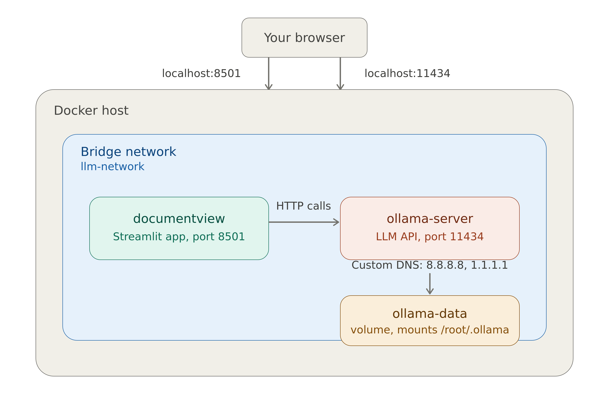

# documentView
The documentView is semantic search and question and answering over a document relying on Retrieval-Augmented Generation (RAG). 

RAG enables specializing Large Language Model (llm) on a particular dataset corpus without complex retraining effort.

To summarized, a RAG process consistes of five steps :
- Load the document a extract the corpus
The first step consistes of extracting the textual content of the doccument from it original medium (either Pdf, web page, or .txt doc). 

- Chunked the document into a serie of overlaping shorter portion
This step consistes of dividing the entire document into a number of smaller chunks

- Vector base :Embeddings and indexing
This step consiste of converting each document chunk into a vector (embedings) using a LLM. Then indexing the embeddings to associated each with appropriate index which enables also to uniquely identify the corresponding chunk. Then ensemble of chunked document, embeddings and indexes correspond to the vector database of the corpus text.

- Retrial and chat (user question) processing
The last step consiste of retreiving information from the document through retreival and generation process. This means, when a user as question, the question is converted to a vector using the same LLM that was used to generate embeddings of the corpus text. The question's embadding is then use to conduct similarity search to vector database, the top k most similar chunk are the retreived.

- Prompt engineering and generation 
Finaly both the question and the top k chunked are used to build the prompt to send to the LLM to generate the final answer that is send back to the user.

# 1. Quickstart

Working with DocumentView is very simple. After installation, one simply need to upload a document and start questionning it. for the moment both `Pdf` and `txt` are supported.

Installation procedure of `DocumentView`.

## 1.1. Installation from repository code 
- clone the repository 
```
  git clone https://github.com/DonaldMOUAFO/documentView.git
```
- Navigate to the documentView/
```
  cd documentView/
```
- Create and activate a virtual environement 
The simplest way to create a virtual environnement is using the following code.
```
  python3 -m venv my/env/name
```
Another common option is using conda. This assumes conda to be installed.
```
  conda create -m my/env/name
```
Activate the virtual environement using one of the following code depending on how it was created.
```
  source my/env/name/bin/activate
  conda activate my/env/name
```
- Install the required packages inside the virtual environements
```
  pip install -r requirement.txt
```
- Install documentView
```
  pip install .
```
If you want to edit the code, do not hesitate to install the package in editable mode `pip install -e .`
After installation, one can then runs it.

`DocumentView` is a two-service local LLM application consiting of `Ollama` server storing the LLM models and the `streamlit` application providing UI to load document and interact with. Therefore, running `DocumentView`requires running both services.

- Run Ollama server
Before to run documentview, runs ollama first to make embedding models available for api call
```
  ollama serve
```
- Run the streamlit app to open UI.
```
  streamlit run src/application/app.py 
```

## 1.2. Installation from docker images 
Pull the docker images of both the ollama server and streamlit app from [documentview's docker registery](https://hub.docker.com/r/donaldmouafo01/documentview)

```
  docker pull donaldmouafo01/documentview:v1.0.0
  docker pull donaldmouafo01/ollama-documentview:v1.0.0
  docker compose -f docker-compose_pulling.yaml up
```
#### Work with `documentview`
After running the previous code, the UI interface can be access at the address [http://localhost:8501]. 
The UI of documentview looks as follows.
<p align="center"> 
  
  <p style="font-size: 18px; color: gray; text-align: center">
    Documentview user interface.
  </p> 
</p>
The user can upload a document to start interacting with.The actual document handel are `Pdf` and `txt`.

### Typical UI for DocumentView and example discussion
The following image is an illustration of the User Interface of DocumentView.
<p align="center"> 
  
  <p style="font-size: 18px; color: gray; text-align: center">
    One can see typical discussion with the uploaded document.
  </p> 
  <!---<li style="color:red"; "text-align: center" ><b>One can see typical discussion with the uploaded document. </li> --->
</p>

# 2. Deploiement from docker container
To run documentview in a server, docker deployement is recommanded.
As already mentioned, it can be seen from the `docker-compose.yml` that `documentview` is a two-service application compose of `ollama` for interacting with llm model via api call and streamlit with the question and answer UI. The image bellow shows the architecture of `documentview`.
<p align="center"> 
  
  <p style="font-size: 18px; color: gray; text-align: center">
    Documentview architecture
  </p> 

</p>

## 2.1 Docker image and container registery

### 2.1.a Build images and runs locally
To build the image and push custom image on docker registery do the following to pull `ollama/ollama:latest` image and build `donaldmouafo01/documentview:v1.0.0`.
```
  docker compose down
  docker compose up -d
```
The application relies on `ollama/ollama:latest` docker image, so docker-compose.yml firt pull it from docker hub. Then the `donaldmouafo01/documentview:v1.0.0` is build.

At this stage of the developement, I decided to provide a costum tag to the ollama image and push it with new tag name to docker hub to make sure the application will work with the same configuration in the future.
```
  docker tag ollama/allama:latest donaldmouafo01/ollama-documentview:v1.0.0
```

- PUSH TO DOCKER UP
```
  docker push donaldmouafo01/ollama-documentview:v1.0.0
  docker push donaldmouafo01/documentview:v1.0.0
```
*Important not* : 
  Pushing `ollama/allama:latest` may not be necessairely as it not diffrent from original image appart from the code bellow which pull `ollama3` model in the container. This is because we can always pull olloma container at any time and from any place where internet is available.
  ```
    docker exec -it ollama-server ollama pull llama3
  ```
  However, relying on ollama directectly requires to pull ollama3 any time `ollama/allama:latest` is pulled.

### 2.1.b Plll costume images and runs locally
Execute the following code the run `documentview` localy
```
  docker compose up -d
```
This pulls both images from Docker Hub automatically (no manual docker pull step needed, Compose does it), creates the `llm-network`, `bridge` and `ollama-data` volume, and starts both containers.

Pull a model into Ollama (unless the image `ollama-documentview` image is used since it already bakes one in).

Documentview is accessible at [http://localhost:8501].
## 2.2 Push docker image to docker hub 

```
  docker push donaldmouafo01/documentview:v1.0.0
```

## 2.3 Docker deploiement from setup.sh
On simple way is to download `setup.sh` on your local computer and excute it as follow.
``` 
  ./setup.sh
```
You can also override the model at runtime without editing the script:
```
  OLLAMA_MODEL=mistral ./setup.sh
```
## 2.3 On windows deskpot or server

### 2.3.1 Installation with setup.ps1
  Windows requires a different approach since it doesn't have bash natively. The equivalent is a PowerShell. The corresponding script is `setup.ps1`.
  To run it, first open PowerShell as Administrator and execute the following code.
  ```
    Set-ExecutionPolicy -ExecutionPolicy RemoteSigned -Scope CurrentUser
    .\setup.ps1
  ```
  Similarly, to use a different model :
  ```
    $env:OLLAMA_MODEL="mistral"; .\setup.ps1
  ```
### 2.3.1 Installation with setup.bat
  More simply, download `setup.bat` file and place it anywhere on the Windows machine and **double-click** on it. 
  Here's what the user's experience looks like:
  ```
    ****************************************************
    *                                                  *
    *        DocumentView  --  Installer               *
    *                                                  *
    ****************************************************

    [INFO]   Checking required tools...
    [OK]     All tools are available.
    [INFO]   Cloning repository...
    [OK]     Repository ready.
    [INFO]   Building Docker images (this may take a few minutes)...
    [OK]     Containers are running.
    [INFO]   Waiting for Ollama to be ready...
    [OK]     Ollama is ready.
    [INFO]   Pulling model 'llama3'...
    [OK]     Model 'llama3' ready.
    [INFO]   Opening the app in your browser...

      Streamlit app  >  http://localhost:8501
      ...
    Press any key to continue . . .
  ```

# 3. Scientific and technical description of documentview

Documentview is composed of five main components :
- Document handeling
- Document cleaning and chunking
- Embedings generation and indexing for vector based building 
- Retrial and chat (user question) processing
- Promt engineering and generation 

## 3.1 Document handeling
Two document types are actualy handles in `documentview` that are `Pdf`and `.txt`.

To handle the text file, the correspond content of the file is first retrieved from the filename using `io.StringIO` package, then the string is after clean and chunks appropriately.

Similarly, for the `PdF` document, the string text is extracted using PyPDF2 package and is `PdfReader` class. Then, the string is cleaned and chunked appropriately.

## 3.2 Document cleaning and chunking
The cleaning process consiste of the following process :
- collapses multiple consecutive newlines into a single newline
- strip out page markers
- remove HTML tags and special characters, keep basic punctuation
- remove non-alphanumeric characters except basic punctuation
- replace tabs with spaces and collapse multiple spaces into one
- collapse multiple spaces into a single space    text = re.sub(r' +', ' ', text)

The text chunking is conducted recursively using a character-based splitter and particularly `RecursiveCharacterTextSplitter` from langchain_text_splitters module. The maximum size of each chunk is 400 characters and the number of overlapping characters between chunks is default to 80 characters.
 
## 3.3 Vector based building : Embeddings generation and indexing
The embedding of the corpus is conducted using SentenceTransformer class from sentence_transformers modules.
The model used is `sentence-transformers/all-mpnet-base-v2` which map maps sentences & paragraphs (chunk) to a 768 dimensional dense vector space to be use for tasks like clustering or semantic search.
The indexing embeddings consiste of constructing the embedding as an object that has an add method to add x_i vector with the dimension of x_i is assumed to be fixed and each x_i associate to ith embedding vector and the corresponding chunck.
I used FAISS to construct a vector store on the load document and the corresponding index. 
Faiss is a library for efficient similarity search and clustering of dense vectors. It contains algorithms that search in sets of vectors of any size, up to ones that possibly do not fit in RAM. It also contains supporting code for evaluation and parameter tuning.

Build a FAISS HNSW index from the given embeddings (A 2D array of embeddings with the shape (num_samples, embedding_dim)). Must be normalized if using IndexHNSWFlat for cosine similarity. The number of neighbors in the HNSW graph (default: 16). `ef_construction (int)` the size of the dynamic list for construction (default: 200) and `ef_search (int)`: The size of the dynamic list for search (default: 64).

## 3.4 Retrieval and chat (user question) processing
The retrieval pipeline consiste of the following steps :
1. Embeddes the question as by the user trought the streamlit app. The step is conducted using exactly the same function used to generate embedding for chunks.
2. Use the question's embedding to retrieve the to k nearrest embeddings of chunk to the vector search or more said faiss index ranked in descending order.  
3. Retrieve the top k coresponding test_chunk based on the top k embedding obtained from embeddings retrieval
4. Build the prompt.

## 3.5 Promt engineering and generation

I adopted a prompt engineering based conversation history aware prompt which consiste of leading llm beeing aware of the history of discussion.

The prompt engineering is build upon a system prompt. 
I implemented two system prompt manageable during the model call to generate answer exlusively base on context or the possibility of generate answer.
Both are the following :
```
  STRICT_SYSTEM_PROMPT = (
    "You are a concise assistant. Use ONLY the provided context. "
    "If the answer is not contained verbatim or explicitly, say you do not know."
  )
  ###
  SYNTHESIZING_SYSTEM_PROMPT = (
    "You are a concise assistant. Rely ONLY on the provided context, but you MAY synthesize "
    "an answer by combining or paraphrasing the facts present. If the context truly lacks "
    "sufficient evidence, say you do not know instead of guessing."
  )
```
Next, the `context` is build with essentially consistes of top k chunked text revieved.

Next, the question is agregated the context and the answer is generated and return to the UI.

*Note : this is non hystory aware prompt*

In order to include history aware prompt, before to send the prompt to the model for anwser generation I agregate to the prompt the history of previous interation to the document. It is only after this, that the prompt is sent to the model for answer generation.

The final prompt engineering is similar to the function below :
```
  def history_aware_prompt(prompt, discussion_historic, last_question):

    history = "\n".join(
        [f"{m['role']}:{m['content']}" for m in messages_historic]
    )

    prompt = f"""{prompt},
    
    Conversation :
    {history}

    Question :
    {last_question}
    """
    return prompt
```

# 4. CI/CD pipeline
The CI/CD pipeline enables to automaticaly build the docker image and push it to docker hub and in the future deploy it on the server all this at any time new push is realise on the branch "main".

Here is the sequence of the step follow a `github actions`to push a new image on docker hub.
- login to docker up : The action uses github secrets  
- Build and push the docker image

This is the architecture of the application for the MLops's CI/CD pipeline logic. 
```
  documentview/
  ├── data
  ├── src
  ├── Dockerfile
  ├── docker-compose.yml
  └── .github/
      └── workflows/
          └── docker.yml
```
